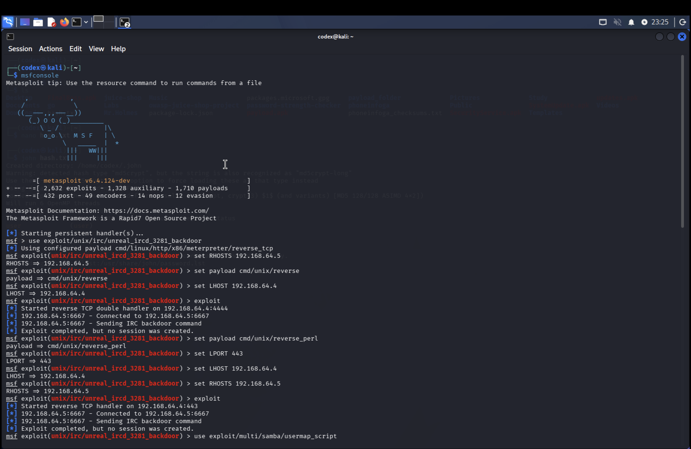
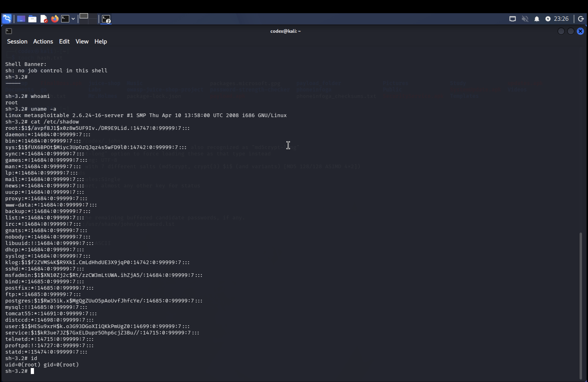
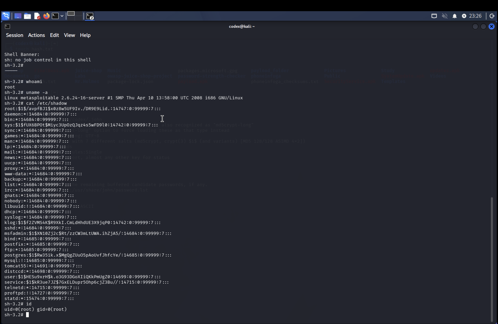
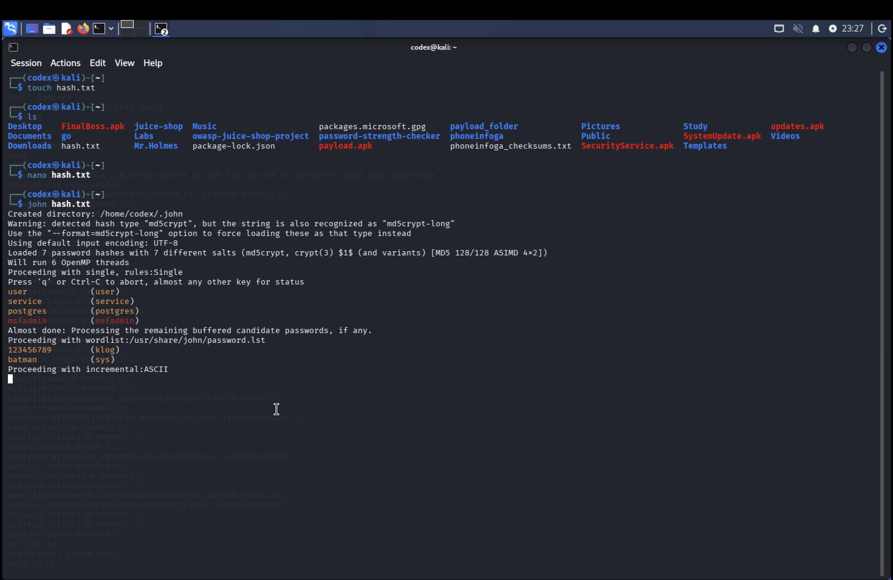
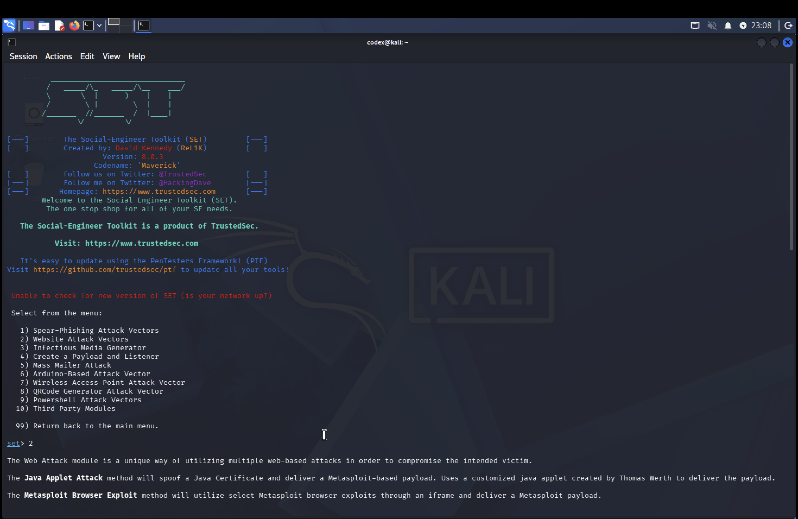

# 💀 PROJECT REDLINE: POST-MORTEM EXPLOITATION REPORT
**ATTACK VECTOR:** Remote Code Execution (RCE) & Credential Harvesting  
**TARGET:** Metasploitable2 (Internal Linux Node)  
**OPERATOR:** Shiv191-bit  
**STATUS:** TOTAL SYSTEM COMPROMISE [UID 0]

##  PHASE 1: INITIAL INFILTRATION (ENTRY POINT)
The engagement initiated with a targeted service-level audit. A critical vulnerability was identified in the **Samba (SMB)** protocol on Port 445.

### [CVE-2007-2447] - Infiltration Successful
I deployed the **usermap_script** exploit via the Metasploit Framework. By crafting a malicious payload within the username field, I successfully bypassed the server's authentication checks.

### Escalation to Root
The payload executed a **Reverse TCP Shell**, punching through the target's defenses. Executing `whoami` and `id` confirmed full **UID 0 (Root)** privileges. At this stage, the host was fully owned.

##  PHASE 2: DATA EXFILTRATION & CRYPTOGRAPHIC AUDIT
With persistence established, the mission shifted to identity harvesting and lateral movement preparation.

### Database Breach
I bypassed system permissions to exfiltrate the **`/etc/shadow`** file. This file contains the cryptographic heartbeat of the system—the encrypted hashes for every registered user.

### Cracking the Vault
The exfiltrated hashes were fed into **John the Ripper**. Utilizing a high-velocity dictionary attack, I decrypted the system passwords (including `msfadmin`, `user`, and `service`) in real-time, demonstrating a catastrophic failure in password complexity policies.

##  PHASE 3: SOCIAL ENGINEERING & CREDENTIAL HARVESTING
The technical breach was followed by a simulation targeting the "Human Firewall."

### The Deception (Victim Perspective)
Utilizing the **Social-Engineer Toolkit (SET)**, I engineered a high-fidelity clone of a Facebook login portal. This malicious site was hosted on an attacker-controlled node at `192.168.1.6`, appearing legitimate to the target.

### The Interception (Attacker Perspective)
The simulation was 100% effective. The **Credential Harvester** intercepted incoming POST requests, logging the victim’s plain-text usernames and passwords directly into my terminal.

##  COUNTERMEASURES & SYSTEM HARDENING
To neutralize these specific attack vectors and protect against future Red Team engagements, the following hardening protocols are **mandatory**:

1. **Patch Vulnerable Binaries:** Update Samba to version 3.0.25 or higher immediately to close the RCE vector.
2. **Egress & Ingress Filtering:** Implement strict firewall rules (iptables/ufw) to drop all unauthorized traffic on Ports 139 and 445.
3. **Identity Protection:** Enforce **Multi-Factor Authentication (MFA)** to render any harvested credentials worthless.
4. **Endpoint Detection:** Deploy **EDR (Endpoint Detection and Response)** to monitor for suspicious process spawns like `/bin/sh` originating from network services.
